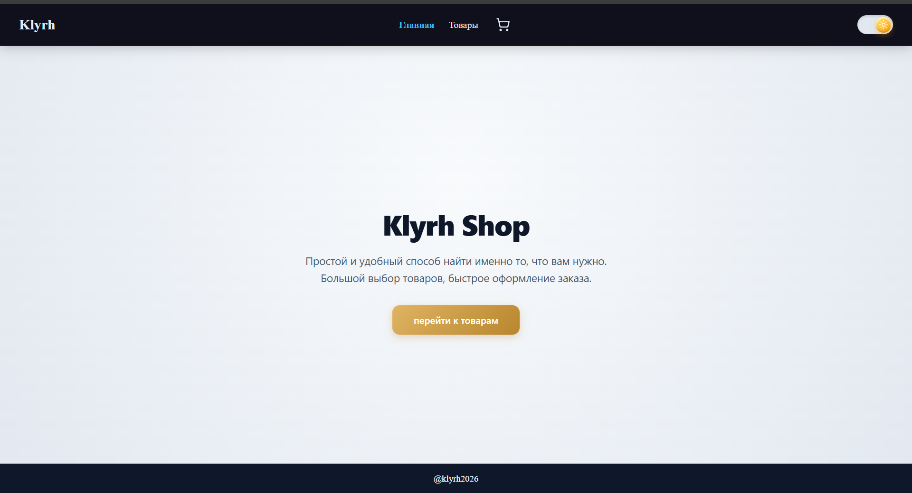
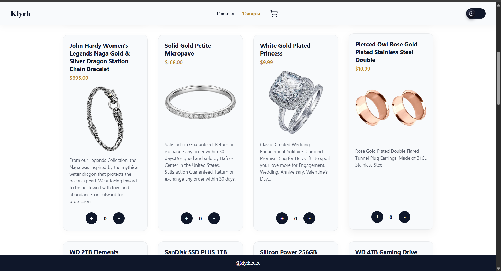
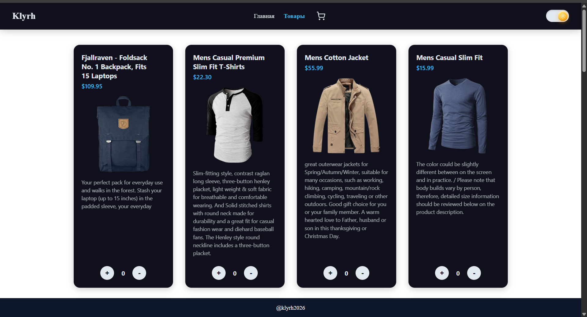
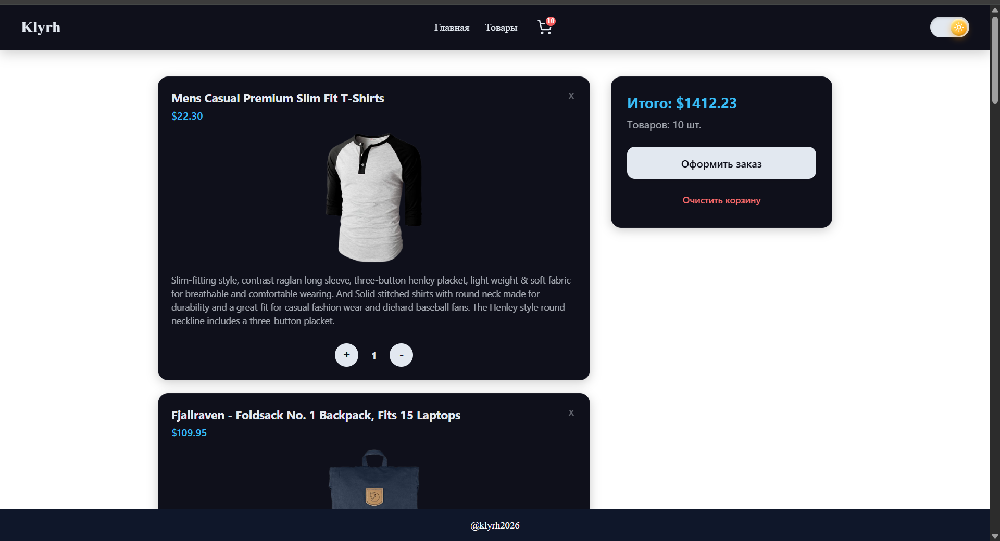
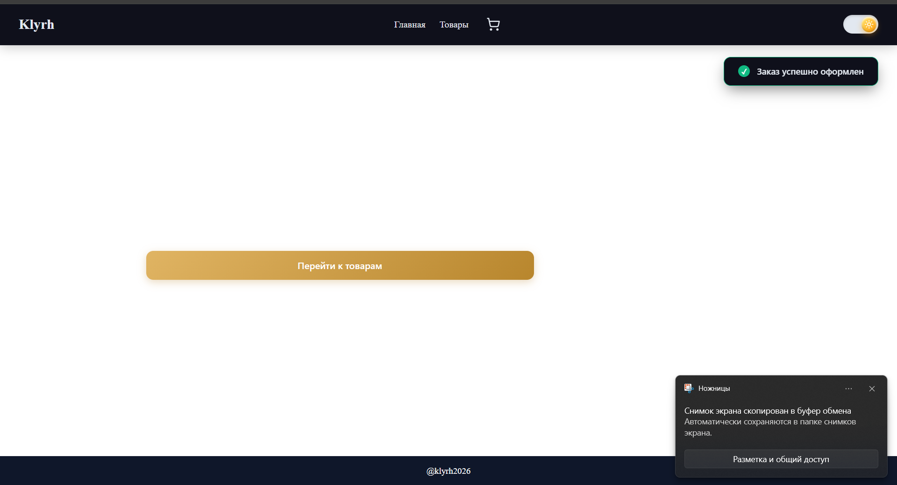
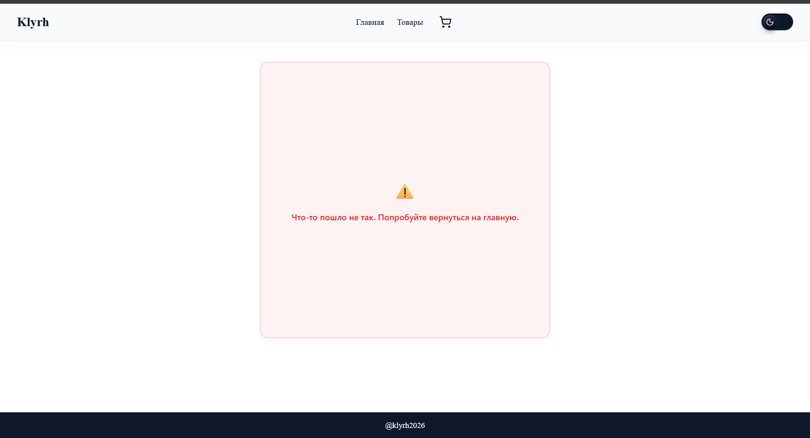

# 🛒 Klyrh Shop

Одностраничное приложение интернет-магазина на **React 18 + Vite**, разработанное в строгом TDD-подходе в рамках учебной программы [The Odin Project](https://www.theodinproject.com/).

🔗 **[Открыть демо на Vercel](https://project-shopping-cart-ashy.vercel.app)**


---

## 📱 Интерфейс приложения

Приложение поддерживает светлую и тёмную тему с переключением в один клик и сохранением выбора в `localStorage`.

|                 Главная (тёмная тема)                  |             Каталог товаров (светлая тема)              |
| :----------------------------------------------------: | :-----------------------------------------------------: |
|  |  |

<details>
  <summary>Показать остальные экраны</summary>

|             Каталог товаров (тёмная тема)              |               Корзина с товарами (тёмная тема)               |
| :----------------------------------------------------: | :----------------------------------------------------------: |
|  |  |

|               Уведомление об оформлении заказа               |                404 — страница не найдена                 |
| :----------------------------------------------------------: | :------------------------------------------------------: |
|  |  |

</details>

---

## О проекте

Каждая фича в этом проекте разрабатывалась по одному и тому же циклу: **ветка → падающий тест → реализация → зелёный тест → коммит → merge в `dev`**. Ни одна функция не писалась без теста, который бы её потребовал.

## ✨ Возможности

- **Каталог товаров** — загрузка из [Fake Store API](https://fakestoreapi.com/), состояния загрузки (skeleton), ошибки сети
- **Корзина** — добавление, удаление и изменение количества товаров, живой подсчёт суммы и количества
- **Оформление заказа** — очистка корзины с авто-исчезающим `Toast`-уведомлением об успехе
- **Тёмная/светлая тема** — переключение в один клик через CSS Custom Properties, выбор сохраняется между визитами
- **Устойчивая маршрутизация** — 404-страница и обработка рантайм-ошибок без потери навбара/футера
- **Доступность** — семантическая разметка, `aria-label`, `role="alert"`/`role="status"`
- **Защита от гонки состояний** — `AbortController` отменяет устаревшие запросы при быстрой навигации

## 🧪 Тестирование

- **~70 тестов** на Vitest + React Testing Library, покрывающих хуки, компоненты, роутинг и утилиты
- Роутинг тестируется через `createMemoryRouter`, включая проверку, что навбар и футер остаются на месте на любом пути, включая 404
- Отдельно протестированы edge-кейсы: отменённые fetch-запросы (`AbortError`) не должны портить состояние `products`/`loading`, авто-исчезающий `Toast` через `vi.useFakeTimers()`, доступные имена интерактивных элементов

```bash
npm run test        # разовый прогон всех тестов
npm run test:watch  # watch-режим
npm run test:ui     # интерактивный UI Vitest
```

## 🛠️ Стек технологий

| Категория     | Технологии                                     |
| ------------- | ---------------------------------------------- |
| Библиотека UI | React 18                                       |
| Сборка        | Vite                                           |
| Роутинг       | React Router v7 (data router API)              |
| Тестирование  | Vitest, React Testing Library                  |
| Стилизация    | CSS Modules, CSS Custom Properties (темизация) |
| Иконки        | lucide-react                                   |
| Деплой        | Vercel                                         |

## 🚀 Установка и запуск

```bash
git clone https://github.com/klyrhaker/Project-Shopping-Cart.git
cd Project-Shopping-Cart
npm install
npm run dev
```

Приложение поднимется на `http://localhost:5173`.

Сборка для продакшена:

```bash
npm run build
npm run preview
```

## 📁 Структура проекта

```
src/
  components/     # Button, Navbar, Footer, Toast, ProductCard, ErrorMessage, Skeleton...
  hooks/          # useCart, useProducts, useTheme, useLocalStorage
  pages/          # HomePage, Shop, CartPage
  services/       # productService — слой работы с API
  utils/          # cartUtils — подсчёт суммы и количества товаров
  test-utils/     # общие утилиты для тестов
  constants/      # константы (URL API и т.д.)
```

Каждый компонент живёт в собственной папке вместе со своим тестом и CSS-модулем.

## 👤 Автор

[klyrhaker](https://github.com/klyrhaker)
